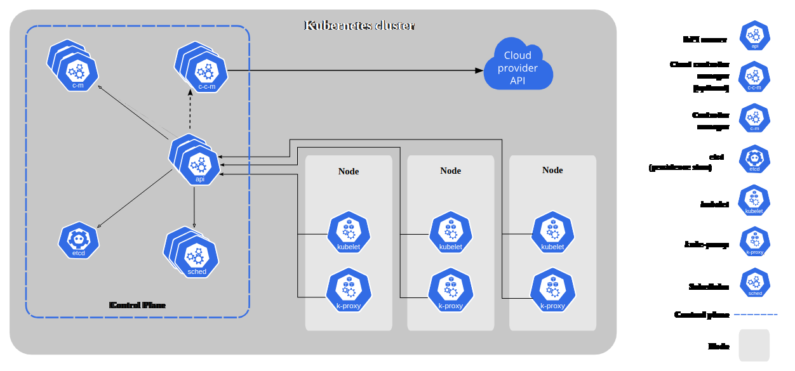

# Kubernates

Kubernates is a powerfull software used to manage containers in production. With the kubernates is possible create
escalable applications.



## [Basic kubernates components](https://kubernetes.io/docs/concepts/architecture/)

- **Cluster:** is a set of nodes;
- **Node:** A node is a worker machine where the kubernate is run;
- **Master:** is a node that controls the cluster;
- **Pod:** is a conteiner that runs in a node. A pod can have one or more containers;

## [Control Plane components](https://kubernetes.io/docs/concepts/overview/components/#kubelet)

- **Kube-apiserver:** this component is API used for users (panel admins, CLI's etc.) and other components for control
  the kubernates;
- **etcd:** is a key-value store used for store neccessary configurations for manage nodes, pods and clusters;
- **kube-scheduler:** is a component that schedule pods to run in the nodes;
- **kube-controller-manager:** is a component that runs controllers of the kube. Is the brain of the cluster;
- **container-runtime:** is the responsible for run the containers (usually docker);
- **kubelet:** is a component that runs in each node and is responsible for manage the node and the pods in the node;

## Kubernates objects definitions

In kubernates is possible create objects and configurations using yaml files and CLI commands. In the next captions we
see as create pods, replicasets, deployments and services using yaml files.

### Pods

In kubernates is possible to define a pod in a node using commands and yaml files. The yaml files is most recomended
because with the files is possible to versioning the definitions. Bellow has a example of a pod definition:

```yaml
apiVersion: v1
kind: Pod
metadata:
  name: myapp-pod
  labels:
    app: myapp
spec:
  containers:
    - name: nginx-container
      image: nginx
      env:
        - name: EXAMPLE_ENV
          value: env-value
```

The properties apiVersion, kind, metadata and spec e default os all definitions in kubernates. In the **apiVersion** the
value is **v1** for pods, the **kind** is Pod, the **metadata** is the **name** of the pod and the **spec** are the
definition of the pod. In the spec we describind the containers that will run in the pod and your properties, as
enviroments variables and the image.

For create a pod using a describe yaml file is necessary use the command **kubectl apply**:

```shell
kubectl apply -f pod-definition.yaml
```

#### [Pod commands](https://kubernetes.io/docs/reference/kubectl/cheatsheet/)

Is possible create a pod using the command **kubectl run**. Bellow has a example of a pod creation using the command:

```shell
kubectl run pod-example --image=nginx
```

For manage created pods we're using bellow commands:

```shell
kubectl get pods # list all pods
kubectl get all # list all resources created
kubectl describe pod <pod-name> # return all informations about created pods
kubectl delete pod <pod-name> # delete the pod
kubectl edit pod <pod-name> # open a atual description of the pod for editing
kubectl get pods -o wide # return informations about pods with more details
```

### Replicasets

Replicasets is a object the manage the pods. The replicasets is used to create and manage pods. Whith replicasets is
possible create many replicas of the pods. Bellow has an example of a replicasets definition:

```yaml
apiVersion: devs/v1
kind: ReplicaSet
metadata:
  name: myapp-replica-set
  labels:
    app: myapp
spec:
  selector:
    matchLabels:
      type: front-end
  replicas: 3
  template:
    metadata:
      name: myapp-pod
      labels:
        app: myapp
        type: front-end
    spec:
      containers:
        - name: nginx-container
          image: nginx
          env:
            - name: EXAMPLE_ENV
              value: env-value
```

In these definitions whe have somes equals properties of the pod definition, but in the **kind** and **apiVersion** we
have diferents values. For the apiVersion the values is **apps/v1** and the kind we have **ReplicaSet**. In the spec
we're describing the **replicas quantity** in the propertie **replica** and in the **template** propertie the definition
for of the pods. The template is equals the pod definition.

For apply the replicasets definition is necessary use the command **kubectl apply**:

```shell
kubectl apply -f replicasets-definition.yaml
```

#### [Reoplicaset commands](https://kubernetes.io/docs/reference/kubectl/cheatsheet/)

The kubectl no has commands for create replicasets, but is possible manage the replicasets using the bellow commands:

```shell
kubectl get replicasets # list all replicasets
kubectl describe replicasets # return all informations about created replicasets
kubectl describe replicasets <replicaset-name> # return all informations about replicaset
kubectl get replicasets -o wide # return informations about replicasets with more details
```

### Deployments